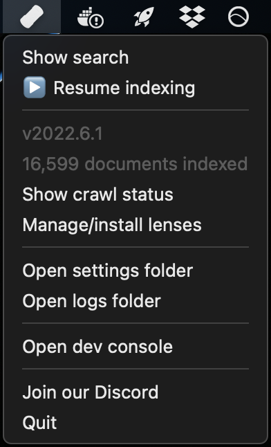
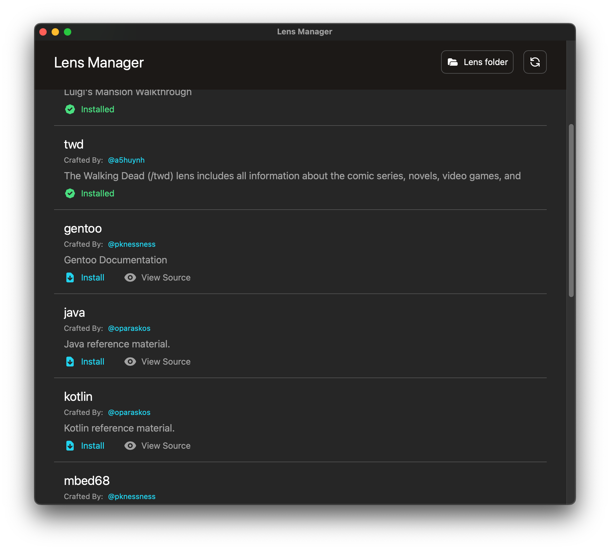

[](https://discord.gg/663wPVBSTB)

# Spyglass

## tl; dr; Spyglass indexes what you want exposing it to you in a super simple & fast interface

⚠️ Spyglass is very much in its early stages, but it’s in a place where it's functional and can be used to replace basic searches. ⚠️

Download now:
    [Mac](https://github.com/a5huynh/spyglass/releases/download/v2022.6.4/Spyglass_22.6.4_x64.dmg)
    | [Windows](https://github.com/a5huynh/spyglass/releases/download/v2022.6.4/Spyglass_22.6.4_x64_en-US.msi)
    | [Linux (AppImage)](https://github.com/a5huynh/spyglass/releases/download/v2022.6.4/spyglass_22.6.4_amd64.AppImage)


Looking for lenses? Check out our [community contributions](https://github.com/spyglass-search/lens-box)!

---

## Table of Contents

* [Installation](#installation)
* [Spyglass in Action](#spyglass-in-action)
* [Why Spyglass](#why-spyglass)
* [How does it know what to crawl](#how-does-it-know-what-to-crawl)
  * [Example: Curated recipe searching](#curated-recipe-searching)
  * [Example: Narrowing down by a specific topic](#curated-recipe-searching)
* [Lens Directory](#lens-directory)
* [Settings](#settings)
  * [Updating the shortcut](#updating-the-shortcut)

---

## Installation

Stable compiled builds are provided on the [releases](https://github.com/a5huynh/spyglass/releases) pages.
Download the appriopriate file for your OS (e.g. `.deb` for linux, `.dmg` for macOS and `.msi` for Windows)

If you're interested in building from source, after checking out the repository run the following:

```
make setup-dev
make build-release
```

## Spyglass in action

Once launched, press **`Cmd + Shift + /`** to open Spyglass. If the app has been
successfully launched, you'll see a little menubar icon like the following:



Queries prefixed with `/` will search through your installed lenses, otherwise it'll
search through your index. Use the arrow keys to select the result you want and hit
`Enter` to open the link in the browser of your choice!

[](https://www.youtube.com/embed/OzNrxtM3s_8)


## Why Spyglass?

Spyglass is a solution to address the following common issues when searching the web.
* Do you add terms such as `reddit` or `wiki` to your searches to narrow it down?
* Do you skip over a full-page of ads before getting to your actual search results
* Do you scroll past dozens of SEO spam pages to find the recipe/review/blog post you were looking for?
* Do you get frustrated with overzealous autocorrect on your search terms?


## How does it know what to crawl?

Spyglass expands on the ideas outlined in [this paper][googles-paper] by the
Brave Search Team.

[googles-paper]: https://brave.com/static-assets/files/goggles.pdf

You can add different lenses that clue the application into what you want to have indexed.
Click on "Manage/install lenses" from the menubar icon to open up the "Lens Manager" as
seen below. From here, you can one-click install lenses from our community and the crawler
will happily go out and start indexing.



You can also create your own lenses, here are some examples that I've been personally using:

### Curated recipe searching

Interested in cooking & recipes? Add a "recipe" lens which will go index a
curated set of websites with high quality recipes.

``` rust
(
    version: "1",
    // Be proud of your creation :). Maybe soon we can share these ;)
    author: "Andrew Huynh",
    name: "recipes",
    description: Some(r#"
        A curated collection of websites with useful, high-quality recipes.
    "#),
    // Set to false if you want to disable this lens
    is_enabled: true,
    domains: [

        // Major sites that often have really good recipes
        "www.seriouseats.com",
        "cooking.nytimes.com",
        ...

        // Specific cuisines/sites that I've found randomly w/ high-quality recipes
        "www.hungryhuy.com",
        "www.vickypham.com",
    ],

    urls: [
        // URLs are considered prefixed, i.e. anything that starts w/ the following
        // will be matched and crawled.
        //
        // https://www.reddit.com/r/recipes/ -> matches
        // https://www.reddit.com/r/recipes_not/ -> does not matche, notice the end slash.
        "https://www.reddit.com/r/recipes/",
    ],

    // Rules allow you to refine how the crawler determine whether it should crawl
    // a URL or not.
    rules: [
        // SkipURL is a simple regex (similar to ones in robots.txt) that when matches
        // a URL will skip crawling it.
        //
        // For example, below I'm skipping over any URLs that have the word "broccoli"
        // in the path, despite the benefits to my health.
        SkipURL("https://www.seriouseats.com/*broccoli*"),
    ]
)
```


### Narrowing down by a specific topic

Interested in the Rust programming language? Add the "rustlang" lens which will
index the Rust book, rust docs, crate.io, and other sites that are related to the
programming language and not the Rust game / The Rust Belt / oxidation / etc.

``` rust
(
    version: "1",
    author: "Andrew Huynh",
    name: "rustlang",
    description: Some("Rustlang targeted websites"),
    is_enabled: true,
    domains: [
        // Support for wildcards in domain names
        "*.rust-lang.org",
        "docs.rs",
        "rustconf.com",
        "crates.io",
        "this-week-in-rust.org",
        ...
    ],

    urls: [
        "https://www.reddit.com/r/rust/",
        "https://www.reddit.com/r/rust_gamedev/",
    ],

    rules: []
)
```

## Lens Directory

Looking for lenses? Check out our [community contributions](https://github.com/spyglass-search/lens-box)!


## Settings

The `settings.ron` file can be found by "Show Settings folder". If there is no
file found in their directory on startup, a default one will be created.

``` rust
(
    // The max number of pages to index per domain
    domain_crawl_limit: Finite(1000),
    // The max number of crawlers per domain
    inflight_domain_limit: Finite(2),
    // The max number of crawlers in total
    inflight_crawl_limit: Finite(10),
    // Not used... yet!
    run_wizard: false,
    // Not used... yet!
    allow_list: [],
    // Domains to completely ignore, regardless of the lenses you have installed.
    block_list: [
      "web.archive.org",
      "w3schools.com"
    ],
    // Shortcut to launch the search bar
    shortcut: "CmdOrCtrl+Shift+/",
    // Where to store your index and index metadata
    // The exact default location is dependent on your OS
    //
    // - NOTE: If you're updating this for Windows, the path needs to use double backward slashes
    //   like so: "E:\\spyglass\\data"
    // - Linux & macOS uses paths like below
    //
    data_directory: "/Users/<username>/Library/Application Support/com.athlabs.spyglass",
    // By default, Spyglass will only crawl things as specified in your lenses. If you want
    // to follow links without regard to those rules, set this to true.
    crawl_external_links: false,
)
```

### Updating the Shortcut

To update the shortcut combine the following modifiers w/ an appropriate
[keycode](https://docs.rs/tao/0.8.3/tao/keyboard/enum.KeyCode.html) combining each key with a "+".

Supported Modifiers:

* "Option" / "Alt"
* "Control" / "Ctrl"
* "Command" / "Cmd" / "Super"
* "Shift"
* "CmdOrCtrl"

Examples:

* "CmdOrCtrl+/" => Launches the app w/ `Cmd` or `Ctrl` + `/`
* "CmdOrCtrl+Shift+/" => Launches the app w/ `Cmd` or `Ctrl` + `Shift` + `/`
* "Shift+4" => Launches the app w/ `Shift` + `4`

NOTE: Shortcuts are allowed to have any number of modifiers but only a *single* key.
For example, `Shift+4` will work but not `Shift+4+2`
